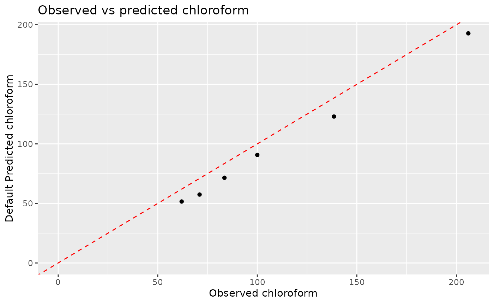
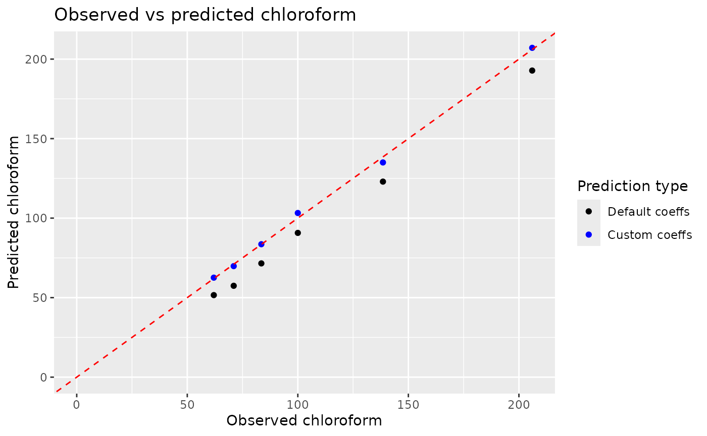

# Fitting and using custom coefficients in chemdose_dbp

This vignette assumes a basic understanding of `define_water` and the S4
`water` class. See
[`vignette("intro", package = "tidywater")`](https://BrownandCaldwell-Public.github.io/tidywater/articles/intro.md)
for more information. Additionally, for more information on tidywater’s
`_df` and `pluck_waters` functions, please see the
[`vignette("help_functions_chemdose_ph", package = "tidywater")`](https://BrownandCaldwell-Public.github.io/tidywater/articles/help_functions_chemdose_ph.md).

## Water setup

Let’s assume we’re working with a drinking water treatment facility that
is concerned about disinfection byproducts (DBPs) in its distribution
system and want to use tidywater to help predict DBP formation due to
chlorine addition. In an initial assessment, we can use the facility’s
influent water and disinfection method to predict DBPs using the
`chemdose_dbp` function.

``` r
influent <- define_water(ph = 7.5, temp = 20, alk = 50, toc = 4, uv254 = .2, br = 50) %>%
  chemdose_dbp(cl2 = 2, time = 8, treatment = "coag", cl_type = "chlorine", location = "plant")
#> Warning in define_water(ph = 7.5, temp = 20, alk = 50, toc = 4, uv254 = 0.2, :
#> Missing value for DOC. Default value of 95% of TOC will be used.
#> Warning in define_water(ph = 7.5, temp = 20, alk = 50, toc = 4, uv254 = 0.2, :
#> Major ions missing and neither TDS or conductivity entered. Ideal conditions
#> will be assumed. Ionic strength will be set to NA and activity coefficients in
#> future calculations will be set to 1.
```

The influent water object now has populated slots corresponding to
predicted DBP concentrations after coagulation, including tthm for total
trihalomethanes and haa5 for sum of haloacetic acids. However, when
comparing these results to the facility’s record, we realize that the
default model coefficients used in `chemdose_dbp` don’t accurately
predict DBP formation at this facility. We can still use `chemdose_dbp`;
we just need to fit coefficients customized for this facility.

## Fitting DBP coefficients

We can use the [`optim()`](https://rdrr.io/r/stats/optim.html) function
to fit custom coefficients to the facility’s DBP data. In this example,
let’s say that only the predictions for chloroform (chcl3) are not
accurate. First, let’s visualize the facility data against the default
DBP predictions. As the graph shows, the default coefficients
consistently under-predict the amount of DBPs formed in the water (the
points are below the 1:1 line).

``` r
# Given sample data
dbp_data <- data.frame(
  ph = c(7, 7.04, 7.5, 7.9, 7.2, 7.25),
  temp = rep(20, 6),
  alk = c(50, 66, 75, 80, 55, 100),
  toc = c(4, 8, 4, 10, 5, 6),
  uv254 = c(0.1, 0.2, 0.2, 0.1, 0.05, 0.2),
  br = rep(50, 6),
  fin_chcl3 = c(62, 138.5, 71, 206, 83.5, 100)
) %>%
  define_water_df("input")

# Predicted chcl3 concentrations using default coefficients
plot_unfit_dbps <- dbp_data %>%
  chemdose_dbp_df("input", cl2 = 2, time = 8, treatment = "raw", cl_type = "chlorine", location = "plant") %>%
  pluck_water(input_waters = c("disinfected"), parameter = c("chcl3"))

ggplot(plot_unfit_dbps, aes(x = fin_chcl3, y = disinfected_chcl3)) +
  geom_point() +
  geom_abline(slope = 1, intercept = 0, linetype = "dashed", color = "red") +
  labs(
    title = "Observed vs predicted chloroform",
    x = "Observed chloroform",
    y = "Default Predicted chloroform"
  ) +
  expand_limits(x = 0, y = 0)
```



Now, we can fit custom coefficients to the facility’s DBP data. The
following code builds off the code we’ve already used above and uses the
default chcl3 coefficients as the initial parameters. Even if
[`optim()`](https://rdrr.io/r/stats/optim.html) doesn’t converge, the
new coefficients it outputs should still provide a better fit than the
defaults. Running [`optim()`](https://rdrr.io/r/stats/optim.html) on
this example should take approximately 2 seconds, which is typical for
an [`optim()`](https://rdrr.io/r/stats/optim.html) function. If
[`optim()`](https://rdrr.io/r/stats/optim.html) is not constrained by a
number of maximum iterations, it can take longer and parallel processing
can be used to speed it up if the time is too long.

``` r
# Model we're trying to fit
model_fn <- function(params, data) {
  custom_coeff <- data.frame(
    ID = "chcl3", "A" = params[1], "a" = params[2], "b" = params[3], "c" = params[4], "d" = params[5], "e" = params[6],
    "f" = params[7], ph_const = NA
  )
  temp_data <- data %>%
    chemdose_dbp_df("input",
      cl2 = 2, time = 8, treatment = "raw", cl_type = "chlorine", location = "plant",
      coeff = custom_coeff
    ) %>%
    pluck_water(input_waters = c("disinfected"), parameter = c("chcl3")) %>%
    mutate(diff = (disinfected_chcl3 - fin_chcl3)^2)
  sum(temp_data$diff)
}

# optimize the coefficients

test <- optim(par = c(6.237e-2, 1.617, -0.094, -0.175, 0.607, 1.403, 0.306), fn = model_fn, data = dbp_data, control = list(maxit = 100))
coeffs <- data.frame(
  ID = "chcl3",
  A = test$par[1],
  a = test$par[2],
  b = test$par[3],
  c = test$par[4],
  d = test$par[5],
  e = test$par[6],
  f = test$par[7],
  ph_const = NA
)

dbp_data <- dbp_data %>%
  chemdose_dbp_df(input_water = "input", output_water = "coeff_disinfected", cl2 = 2, time = 8, coeff = coeffs) %>%
  pluck_water(input_waters = c("coeff_disinfected"), parameter = c("chcl3"))

ggplot() +
  geom_point(data = plot_unfit_dbps, aes(x = fin_chcl3, y = disinfected_chcl3, color = "Default coeffs")) +
  geom_point(data = dbp_data, aes(x = fin_chcl3, y = coeff_disinfected_chcl3, color = "Custom coeffs")) +
  geom_abline(slope = 1, intercept = 0, linetype = "dashed", color = "red") +
  labs(
    title = "Observed vs predicted chloroform",
    x = "Observed chloroform",
    y = "Predicted chloroform"
  ) +
  scale_color_manual(
    name = "Prediction type",
    breaks = c("Default coeffs", "Custom coeffs"),
    values = c("black", "blue")
  ) +
  expand_limits(x = 0, y = 0)
```



Note that when inputting the new coefficients into `chemdose_dbp`, they
must be formatted as a data frame with the proper column names: ID
(corresponding to which DBP these coefficients apply to - for individual
species, this will be its chemical formula), A, a, b, c, d, e, and
f. This data frame can then be passed as an argument into `chemdose_dbp`
and its helper function. For this example, we can visualize the facility
DBP data, default DBP predictions, and custom DBP coefficient
predictions to see that the predictions from `chemdose_dbp` with custom
coefficients fits the real data a little better because it’s closer to
the 1:1 line. This coefficient optimization process can be repeated for
any DBPs whose concentrations do not fit the default coefficients well.
Now that the facility has custom coefficients for chloroform, they can
continue to use `chemdose_dbp` with coefficients that are personalized
to the plant and make better predictions for their effluent chloroform.

## Summary

In this tutorial, we learned how to use custom coefficients to predict
DBP concentrations using the `coeff` argument in `chemdose_dbp`. These
custom coefficients can be obtained by fitting using
[`optim()`](https://rdrr.io/r/stats/optim.html) and saved as a new data
frame containing the personalized values. The `coeff` argument gives the
user flexibility to create a model that best reflects their specific
conditions while still using the tidywater package.

For an introduction to the tidywater package, check out the intro and
tidywater vignettes.
