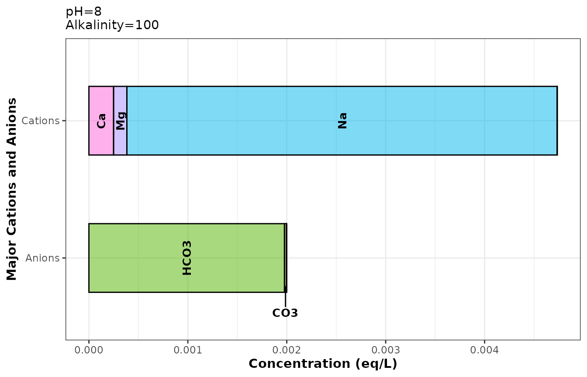
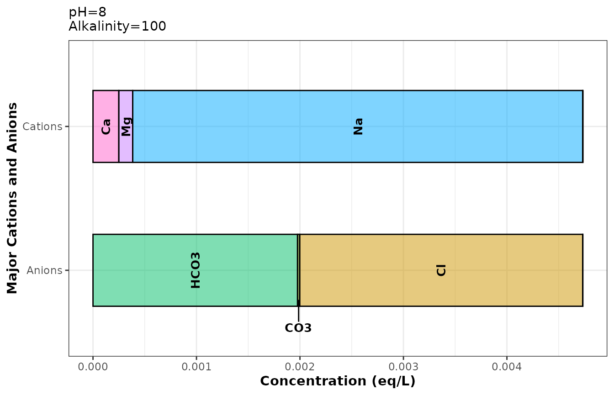
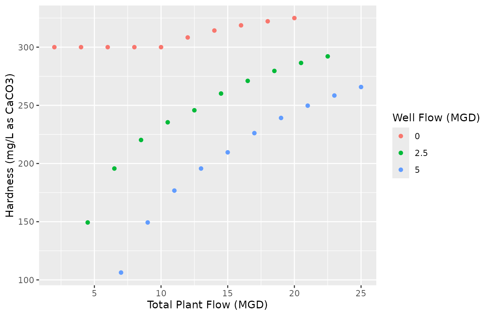

# Blending Multiple Waters

This vignette assumes a basic understanding of `define_water` and the S4
`water` class. See
[`vignette("intro", package = "tidywater")`](https://BrownandCaldwell-Public.github.io/tidywater/articles/intro.md)
for more information. Additionally, for more information on tidywater’s
`_df` and `pluck_waters` functions, please see the
[`vignette("help_functions_chemdose_ph", package = "tidywater")`](https://BrownandCaldwell-Public.github.io/tidywater/articles/help_functions_chemdose_ph.md).

## Blending analysis setup

In this analysis, a hypothetical drinking water utility sources their
water from a river and a lake, both of which have high hardness. The
operators are investigating whether blending up to 5 MGD from two
groundwater wells will reduce the total hardness below 200 mg/L as
CaCO3.

## Well setup

First, let’s take a look at the available groundwater data from Well A
and Well B. We use `define_water_df` so that other models can be added
to the dataframe.

``` r
# Read in data from Wells A and B
raw_wells_water <- tibble(
  Well = c("A", "B"),
  ph = c(8, 9),
  alk = c(100, 150),
  temp = c(18, 19),
  ca = c(5, 10),
  cond = c(500, 900),
  tds = c(300, 500),
  na = c(100, 200),
  k = c(0, 20),
  cl = c(0, 30),
  so4 = c(0, 0)
) %>%
  define_water_df() %>%
  balance_ions_df()

raw_wells_water
># 
[38;5;246m# A tibble: 2 × 3
[39m
>#   Well  defined balanced
>#   
[3m
[38;5;246m<chr>
[39m
[23m 
[3m
[38;5;246m<list>
[39m
[23m  
[3m
[38;5;246m<list>
[39m
[23m  
># 
[38;5;250m1
[39m A     
[38;5;246m<water>
[39m 
[38;5;246m<water>
[39m 
># 
[38;5;250m2
[39m B     
[38;5;246m<water>
[39m 
[38;5;246m<water>
[39m
```

It’s always a good idea to verify our code is working properly. To make
sure that our data was balanced using `balance_ions_df`, we can plot our
`water` class using `plot_ions`. The below example shows how to index a
`water` class column: dataframe\$water_class_column\[\[row_number\]\]

``` r
# Ion plot before balance_ions_df was applied
raw_wells_water$defined[[1]] %>%
  plot_ions()
```



``` r
# Plot of balanced ions
raw_wells_water$balanced[[1]] %>%
  plot_ions()
```



Let’s continue with our blending analysis. We’re going to treat our two
wells as a single groundwater source. Blending can be calculated as
Well_A_ratio \* Well_A concentration + Well_B_ratio \*
Well_B_concentration. This is fine for most parameters, but for pH and
acid/base equilibrium species, blending is a little more complicated.
Enter: `blend_waters`. This function blends waters as you’d expect, and
does all the pH blending math for you. In the example below, we’re going
to be blending inefficiently. But don’t worry, there will be a better
blending example later.

To mix our two wells, we will blend row 1 of `balanced_water` with row 2
of `balanced_water`. This “vertical” blending is not efficient and will
not be useful for large data frames. `water` objects cannot be pivoted,
hence the row-to-row blending. In later examples, we will actually blend
columns, which is more amenable to piped code chunks.

The `balanced_water` function takes 2 or more waters (must be of the
`water` class), and corresponding ratios for each water.

``` r
# Blend "vertically": blends the data in well A's row with that of well B's.
# The pluck function from the purrr package is useful for indexing a water class column
### First, index the water column using the name or number of the column (ie "balanced_water" or 3 (column number))
### Next, index the row

blended_wells_water <- blend_waters(
  waters = c(
    pluck(raw_wells_water, "balanced", 1),
    pluck(raw_wells_water, 3, 2)
  ),
  ratios = c(.5, .5)
)
# outputs a water class object.
blended_wells_water
># pH (unitless):  8.72 
># Temperature (deg C):  18.5 
># Alkalinity (mg/L CaCO3):  125 
># Use summary functions or slot names to view other parameters.
```

## Blending scenarios and finish source setup

We will create a data frame of the blend scenarios we will be modeling,
in this case, we are varying flow rates from the different sources.

``` r
# Assume wells can contribute up to 5 MGD each
groundwater <- tibble(Wells_flow = c(0, 2.5, 5))
# Blending scenarios and the resulting source water ratios
scenarios <- tibble(
  surface_flow = seq(2, 20, 2),
  River_flow = c(seq(2, 10, 2), rep(10, 5)),
  Lake_flow = c(rep(0, 5), seq(2, 10, 2)),
) %>%
  mutate(group = row_number()) %>%
  cross_join(groundwater) %>%
  mutate(
    total_flow = River_flow + Lake_flow + Wells_flow,
    River_ratio = River_flow / total_flow,
    Lake_ratio = Lake_flow / total_flow,
    Wells_ratio = Wells_flow / total_flow
  )
```

To finish blending our wells, we will transform the `blended_wells`
`water` object into a data frame containing a `water` column.

The river and lake sources don’t require any mixing. We’ll set up their
raw data and balance the ions using `define_water_df` to make a data
frame with a `water` column. In `balance_ions_df`, we are specifying the
name of the output columns so we can use the different water sources
later. Most of tidywater’s `_df` functions have the option to name the
output column. Defaults vary depending on the `_df` function.

``` r
Wells_water <- tibble(wells = c(blended_wells_water))

River_water <- tibble(
  ph = 7, temp = 20, alk = 200, tds = 950, cond = 1400,
  tot_hard = 300, na = 100, cl = 150, so4 = 200
) %>%
  define_water_df() %>%
  balance_ions_df(output_water = "river") %>%
  select(-defined)

Lake_water <- tibble(
  ph = 7.5, temp = 19, alk = 180, tds = 900, cond = 1000,
  tot_hard = 350, ca_hard = 250, na = 100, cl = 100, so4 = 150
) %>%
  define_water_df() %>%
  balance_ions_df(output_water = "lake") %>%
  select(-defined)
```

## Blending multiple sources

Now that we have our 3 sources defined, balanced, and cleaned up, we can
blend them. This next code chunk showcases the power of working in a
data frame. We’ll use `blend_waters_df`, the helper function for
`blend_waters`. We already created `water` class columns above, so we’ll
use those column names in the `waters` argument. The ratios for each
water source were calculated in the `scenarios` data frame. We’ll pass
the names of those ratio columns into the `ratio` argument. The ratios
must always add up to 1, otherwise the function will not run.

``` r
blend_water <- scenarios %>%
  cross_join(Wells_water) %>%
  cross_join(River_water) %>%
  cross_join(Lake_water) %>%
  blend_waters_df(
    waters = c("wells", "river", "lake"),
    ratios = c("Wells_ratio", "River_ratio", "Lake_ratio")
  )
```

With all three source waters blended for each tested scenario, we can
pull out a parameter of interest using `pluck_water`. Finally, we finish
by plotting our parameter of interest with the `ggplot` package.

``` r
plotting_data <- blend_water %>%
  pluck_water(input_water = "blended", "tot_hard")

# Plot the results!
ggplot(plotting_data, aes(x = total_flow, y = blended_tot_hard, color = as.character(Wells_flow))) +
  geom_point() +
  labs(
    y = "Hardness (mg/L as CaCO3)", color = "Well Flow (MGD)",
    x = "Total Plant Flow (MGD)"
  )
```



## Summary

In this tutorial, we learned how to use the `blend_waters` function to
determine resulting water quality of multipled mixed sources. The
function inputs `water` objects and their blending ratios, and outputs a
new column storing updated parameters with the class `water`.

We also got more practice using helper functions with the `_df` suffix
and also `pluck_water`. For more context on helper functions or to learn
more about the `chemdose_ph` and `solvedose_ph` functions, please see
[`vignette("help_functions_chemdose_ph", package = "tidywater")`](https://BrownandCaldwell-Public.github.io/tidywater/articles/help_functions_chemdose_ph.md).
