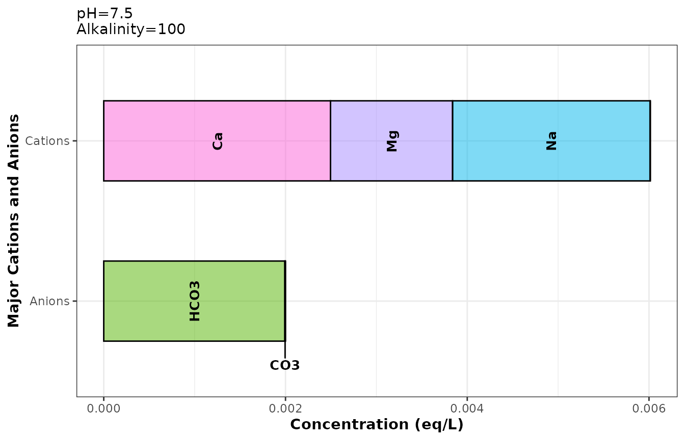
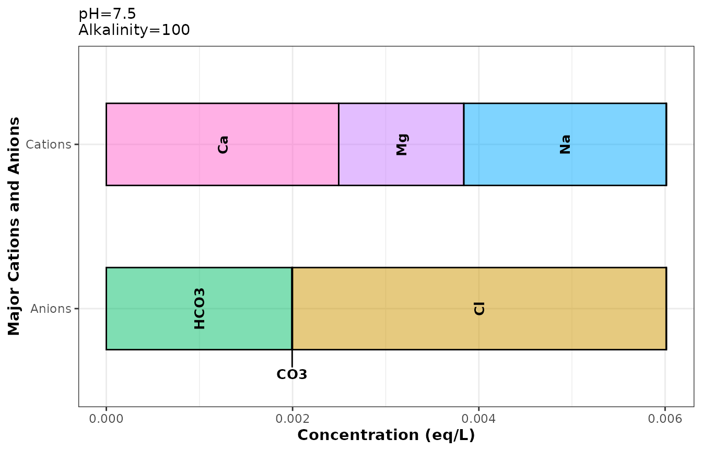

# Introduction to tidywater: Basic functions

## Getting started

The tidywater package allows you to quickly model complex water quality
and treatment processes using the R programming language. First, install
the tidywater package and load the library.

``` r
library(tidywater)
```

## Defining a water

The first step for any modelling project using tidywater is to define
your starting water quality. This can be done using the `define_water`
function. This function allows you to input everything you know about
your water (pH, alkalinity, temperature, etc.). It also standardizes
units for subsequent modelling steps, calculates the carbonate balance
from the alkalinity and pH (if provided), and estimates the ionic
strength of the water from your inputs. The function then takes all this
information and creates a unique object of class “water” (for more
details, see [R’s S4 class](https://adv-r.hadley.nz/s4.html)).

The “water” class is the building block of tidywater and allows you to
keep track of all the changes in your water through various water
treatment processes in a tidy way. Think of the “water” class as a
snapshot of everything that is known about a water at each step in a
modelling process.

Why does tidywater depend on this special class instead of just using a
data frame? The water class is a good way to standardize inputs and set
up a data structure that would reduce user error. Funneling users
through `define_water` reduces naming errors in downstream functions. It
also ensures that all slots have the proper data class. For example,
`ph` must always be a number, and `treatment` is always a character.

To start, let’s create a blank water class and call it `empty_water.`

``` r
empty_water <- define_water()
#> Warning in define_water(): Missing value for pH. Carbonate balance will not be
#> calculated.
#> Warning in define_water(): Missing value for alkalinity. Carbonate balance will
#> not be calculated.
#> Warning in define_water(): Major ions missing and neither TDS or conductivity
#> entered. Ideal conditions will be assumed. Ionic strength will be set to NA and
#> activity coefficients in future calculations will be set to 1.
```

Notice that several warnings are generated about the water class.
`define_water` will return warnings noting the assumptions and
limitations of the water class depending on how much information you
provided. For example, since we did not provide any information about
the water’s pH or alkalinity, the carbonate balance cannot be
calculated. Similarly, since we did not provide any information about
major ions in the water, information about the water’s hardness and
ionic strength are missing.

Even so, we successfully created our first water class! You can view the
first few slots that a water class can contain by printing
`empty_water`. But there are slots for general parameters, carbon
content, corrosivity indicators, major cations and anions, and
disinfection byproducts (DBPs). Different functions within tidywater
will allow you to model all these parameters and more.

``` r
print(empty_water)
#> pH (unitless):  NA 
#> Temperature (deg C):  25 
#> Alkalinity (mg/L CaCO3):  NA 
#> Use summary functions or slot names to view other parameters.
```

So let’s add some things to this water that we already know. Let’s say
we know pH, alkalinity, temperature, and the sodium concentration. We
can define each of these parameters as arguments in `define_water`,
which accepts pH (unitless), alkalinity in units of mg/L CaCO3,
temperature in degrees C, and ions in mg/L (with the exception of
bromide and manganese, reported as ug/L). The function also refers to
all chemical compounds by their chemical symbol or formula. Let’s call
the new water class `my_water.`

Notice that the slots for `ph`, `alk`, `temp`, `na`, and `ca` are now
populated, but we’ll need to use slot names to see most of the
information. The ions slots (`na`, `ca`) are output in units of mol/L
(M). We can also see that `define_water` automatically calculated the
amount of carbonate (`co3`) and bicarbonate (`hco3`) in the water based
on the alkalinity and pH.

``` r
my_water <- define_water(ph = 7.5, alk = 100, temp = 20, na = 50, ca = 50)
my_water
#> pH (unitless):  7.5 
#> Temperature (deg C):  20 
#> Alkalinity (mg/L CaCO3):  100 
#> Use summary functions or slot names to view other parameters.
my_water@na
#> [1] 0.00217488
my_water@hco3
#> [1] 0.001992775
```

You can easily summarize your water quality using the `summarize_wq`
function, which takes a water class object and exports an easy-to-read
table of the water quality into the console.

``` r
summarize_wq(my_water)
```

[TABLE]

This is a great way to get started with `tidywater` for users who only
need to model a single water quality. If you have a large data set with
multiple water qualities that you want to model, though, this might
sound tedious. It wouldn’t be possible to manually enter your pH,
alkalinity, temperature, etc. for, let’s say, 5,000 rows. Instead,
`tidywater` has helper functions to generate many water classes
simultaneously from an imported data set. See the `help_functions_blend`
vignette for large data processing (paste this in the console:
`vignette("help_functions_blend", package = "tidywater")`).

## Plotting and balancing ions

Back to our single use case, you’ll notice one of the warnings alerts
the user to missing cations and/or anions, and that you should use
`balance_ions` to correct this. This is based on the electroneutrality
principle which states that the charges of all the cations and anions in
a water should add up to 0. If your water is missing any ions, it is
likely that it isn’t balanced. This could cause the results of your
model to be off.

To check, you can use the `plot_ions` function on our `water` object to
see what the current ion balance looks like. You can see that cation and
anion bars are not equal, so this is not very realistic.

``` r
plot_ions(my_water)
```



To correct this, the `balance_ions` function automatically adds in
sodium, potassium, chloride, or sulfate until anions + cations = 0.
Let’s see what happens to the ion plot when we use `balance_ions` to
estimate the missing ion concentrations.

``` r
balanced_water <- my_water %>% balance_ions()
plot_ions(balanced_water)
```



Great! `balance_ions` added chloride to `my_water` so it is now
electrically neutral. To see how much chloride was added, you can use
the “@” symbol with a `water` class object to access the slot you want,
in this case, chloride

``` r
my_water@cl # We did not input any chloride in the original water
#> [1] NA

balanced_water@cl # The balanced water now contains chloride
#> [1] 0.004015285
```

## Converting units

The chloride units are in M. What if you want to know what that is in
mg/L? There are two ways to do this in tidywater. The easiest way is to
use the `summarize_wq` function shown above, which converts the ion
concentrations back to mg/L.

Another option is to use the `convert_units` function, which allows you
to specify the chemical and the starting and ending units. In this case,
we want to convert the chloride concentration in `balanced_water` from M
to mg/L.

``` r
convert_units(value = balanced_water@cl, formula = "cl", startunit = "M", endunit = "mg/L")
#> [1] 142.3539
```

## Modelling assumptions

### Ionic strength

When possible, `define_water` will calculate ionic strength of the
water, either based on TDS, conductivity, or the ions provided in the
water. Most functions will work fine if you don’t know the ionic
strength, but especially when it comes to pH chemistry, it’s good to
include all the information you have. Note that in our original water,
we didn’t provide enough ions for the ionic strength to be determined.
We can remedy this in a few ways.

``` r
# The ionic strength slot was NA in the original water because we did not
# provide enough information to calculate it
my_water@is
#> [1] NA

# Input TDS or conductivity
new_water1 <- define_water(ph = 7.5, alk = 100, temp = 20, na = 50, ca = 50, tds = 100)
#> Warning in define_water(ph = 7.5, alk = 100, temp = 20, na = 50, ca = 50, :
#> Missing values for magnesium and total hardness but calcium supplied. Default
#> ratio of 65% Ca2+ and 35% Mg2+ will be used.
new_water2 <- define_water(ph = 7.5, alk = 100, temp = 20, na = 50, ca = 50, cond = 200)
#> Warning in define_water(ph = 7.5, alk = 100, temp = 20, na = 50, ca = 50, :
#> Missing values for magnesium and total hardness but calcium supplied. Default
#> ratio of 65% Ca2+ and 35% Mg2+ will be used.
# Input more known ions
new_water3 <- define_water(ph = 7.5, alk = 100, temp = 20, na = 50, ca = 50, so4 = 100)
#> Warning in define_water(ph = 7.5, alk = 100, temp = 20, na = 50, ca = 50, :
#> Missing values for magnesium and total hardness but calcium supplied. Default
#> ratio of 65% Ca2+ and 35% Mg2+ will be used.

new_water1@is
#> [1] 0.0025
new_water2@is
#> [1] 0.0032
new_water3@is
#> [1] 0.008009908
```

There are a couple of other assumptions that `define_water` makes to be
able to set up the data for downstream `tidywater` functions. These
include standard ratios for hardness and DOC.

### Hardness

First, when only you only know the total hardness of the `water`
(`tot_hard`), calcium hardness (`ca_hard`) is assumed to be 65% of the
total, which is about average for [U.S. drinking
water](https://www.ars.usda.gov/ARSUserFiles/80400525/Articles/NDBC32_WaterMin.pdf).
When only `ca_hard` is provided, `tot_hard` is assumed to be equal to
calcium hardness/0.65. Magnesium hardness (`mg_hard`) is then calculated
as total hardness - calcium hardness.

Let’s look at this using `define_water`. We can use `convert_units` to
get the output in standard units of hardness. By defining only the total
hardness, we see that the `water` vector also contains estimates for
calcium and magnesium.

``` r
# Calculate hardness or calcium hardness
hard_water <- define_water(8, 20, 100, tot_hard = 150)

# total hardness in mg/L CaCO3
hard_water@tot_hard
#> [1] 150

# calcium hardness
convert_units(value = hard_water@ca, formula = "ca", startunit = "M", endunit = "mg/L CaCO3")
#> [1] 97.5

# magnesium hardness
convert_units(value = hard_water@mg, formula = "mg", startunit = "M", endunit = "mg/L CaCO3")
#> [1] 52.5
```

### Total and dissolved organic carbon

TOC and DOC inputs operate similarly to hardness. TOC and DOC are
important to know for modelling and predicting various water treatment
processes. If you only know TOC, `define_water` applies a standard
conversion to estimate DOC, and vice versa. If only `toc` is provided,
`doc` is assumed to be 95% of the TOC. If only `doc` is provided, `toc`
is assumed to be DOC/0.95. This ratio would generally be an acceptable
estimate for most drinking water scenarios, but the amount of TOC that
is dissolved in raw waters could vary widely. [Westerhoff and Anning,
2000](https://doi.org/10.1016/S0022-1694(00)00292-4) reported a range of
10-100% dissolved TOC in 25 surface waters, so keep in mind that the
standard conversion may not be right for your context.

``` r
# Calculate TOC and DOC
toc_water <- define_water(8, 20, 100, toc = 3)
toc_water@toc # mg/L
#> [1] 3
toc_water@doc # mg/L
#> [1] 2.85

doc_water <- define_water(8, 20, 100, doc = 1.3)
doc_water@toc # mg/L
#> [1] 1.368421
doc_water@doc # mg/L
#> [1] 1.3
```

Overall, `tidywater` helps you model scenarios with as little
information as possible because we often don’t have all the data we
would like, but the less you have to assume about your water, the
better. It’s important to understand and list the assumptions you are
making during any modelling effort.

## Summary and Recommended Resources

In this tutorial, we were introduced to the `water` object and the water
quality parameters specified in it. We added water quality data using
the `define_water` function, and modified the water to meet the
electroneutrality principle by balancing ions with `balance_ions`. The
change was also visualized using `plot_ions`. The built-in unit
conversion function `convert_units` was also introduced.

Next, we looked at some assumptions built into the model for ionic
strength, hardness, and TOC/DOC that are able to fill in related water
quality parameters based on accepted practice and empirical research in
order to set up for future tidywater functions. Note that the fewer
assumptions you have about your water, the better the prediction.

Check out our other vignettes to learn more about tidywater’s functions
for modelling softening, coagulation, and DBP formation. Please note
that as many models have been included as possible, however, users
should be aware that models have varying degrees of accuracy and
applicability. To learn more, read the references provided in the
Description file for the models implemented.
